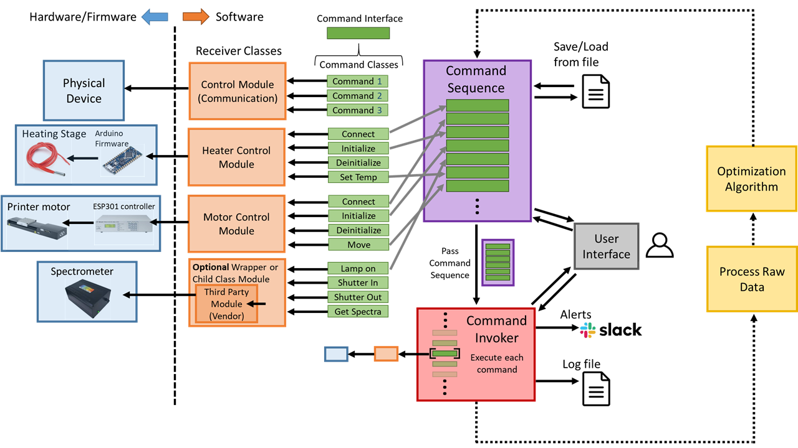

# LabAutomation
LabAutomation is a modular framework for automating multiple devices or instruments capable of being controlled through Python. It can be combined with optimization algorithms for autonomous process optimization.

### Table of Contents
1. [Description](#description)
2. [Supported Devices](#supported-devices)
3. [Getting Start](#getting-started)
    - [Requirements](#requirements)
    - [Installation](#installation)
4. [Usage](#usage)
    - [Automation](#automation)
    - [Optimization](#autonomous-process-optimization)
5. [Further Details](#further-details)
    - [Creating Device Modules](#creating-device-modules)
    - [Creating Command Modules](#creating-command-modules)
        - [Composite Commands](#composite-commands)
    - [Program Scheme](#program-scheme)
6. [License](#license)

## Description
LabAutomation was developed for the purpose of automating laboratory experiments to enable high-throughput data collection and process optimization. It can be used to automate experimental procedures that involve instruments from different vendors, with different communication protocols, and also home-built equipment. The automated procedures can then be tied into sequential model-based optimization algorithms (e.g. Bayesian optimization) to enable self-driving, autonomous lab experiments.

LabAutomation implements the command pattern in order to execute a command sequence, or 'recipe'. Several devices and commands have already been implemented (see below). As long as you can create commands for your device in Python it can easily be used in conjunction with other devices due to the modular nature of the command pattern. Further details on the program structure and how to create new devices, commands, and recipes are shown below. 

Here are some features of the program:
- Saving and loading of recipes to .yaml files
- Looping of recipe sub-sections for repeated procedures or for parametric sweeps
- Creation of sub-recipes or more complex commands through the use of composite commands
- Recipe pausing for semi-automated recipes that require manual actions in between commands
- Logging of all command details and their execution result
- Slack channel notification and log file upload when command execution encounters an error

## Supported Devices
The following devices have tested receiver and command modules:
- Newport stages controlled by ESP-301/ESP-302 motion controllers
- StellarNet Spectrometers (multiple spectrometers and spectra merging supported)
- Ximea cameras
- Arduino-based stepper motor(s) ([click here for materials, schematic, and code](https://github.com/JustinJKwok/Arduino-PID-heater))
- Arduino-based PID controlled resistive heater ([click here for materials, schematic, and code](https://github.com/JustinJKwok/Arduino-multi-stepper))

The following devices are planned to be added:
- Kinova gen7 robot arm
- IKA hot/stir plates
- Hamilton PSD/6 syringe pump
- Shutter and lamp control for StellarNet Spectrometers
- More to come...

## Getting Started
### Requirements
This package was developed using Python 3.8. 
The required packages are listed below. The versions used during developement are indicated in parenthesis. If a specific version is required it will be indicated.
- The core framework only requires PyYaml (5.4.1)
- Slack notifications are optional and require slackclient (2.9.3)
    - Store your bot token as an environmental variable
- The recipe_tool.py text-based UI requires questionary (1.10.0) and colorama (0.4.4)
- Any device that communicates via serial requires PySerial (3.5)
- StellarNet spectrometers:
    - NumPy (1.20.3)
    - Pandas (1.3.1)
    - SciPy (1.7.0)
    - pyusb (1.0.0b1 required)
    - [stellarnet_driver file from vendor](https://www.stellarnet.us/software/spectrometer-python-application-driver/)
- Ximea cameras:
    - [xiAPI](https://www.ximea.com/support/wiki/apis/Python)
    - Pillow (8.3.1)

To run example 6 which combines automation with Bayesian optimization you will need:
- NumPy
- Matplotlib
- Pandas
- Scikit-Optimize

### Installation
Download the repository and create a recipe using a script or the recipe_tool.py UI. See Usage for examples.

## Usage
### Automation
The general workflow is as follows:
- If not created, create the receiver and command modules for your device (see below for more info)
- Create a command sequence
- Add devices you plan to use to the command sequence
- Add commands to the command sequence
- Create a command invoker and pass it the sequence during construction
- Invoke the commands to execute them

There are three ways to create and modify the command sequence:
1. Use a .py script to create the command sequence (recommended)
2. Use the recipe_tool.py text-based UI (recommended for simple recipes only)
3. For a saved sequence, you can edit the .yaml file directly (recommended for small modifications only)

The first method is recommended. Please go through the example scripts 1 to 5 in the examples folder to learn how they work. The examples use fake devices (DummyHeater and DummyMotor) and commands so you do not need to have actual hardware to run the examples.
Run the examples from root using:
```
python -m examples.example#
```

For the second method you can use run the text-based UI tool from root using:
```
python recipe_tool.py
```
You can start creating and executing recipes with the DummyHeater and DummyMotor devices. You can also load an example recipe from recipes/ui_recipe_example.yaml. Note that the recipe_tool UI does not currently support CompositeCommands.

For the third method you can inspect any of the recipe .yaml files and make changes to them (except for example1.yaml as it is loaded in example2)

### Autonomous Process Optimization
[Example 6](examples/README.md#example-6:-autonomous-process-optimization) demonstrates a method of combining automated recipes with Bayesian optimization using scikit's optimize package. Please see their Optimizer or gp_minimize examples to get familiar with the workflow. 

Example 6 emulates optimization of a material processing experiment. It uses a fake measurement device (DummyMeter) that 'measures' some property from a random noisy objective function surface that depends on a DummyHeater's temperature and a DummyMotor's speed. You can think of it as corresponding to some process like 3d printing or ink coating (i.e. What printing temperature and speed gives me the best material property?).

You will need some more packages to run example 6 (listed above). Run example 6 as stated above from root.

## Further Details
### Creating Device Modules
Please see the devices folder for examples of implementing device modules

To create a device (receiver) module, you must either 
1. write a Python module yourself that communicates with and controls the physical device
2. if it is a commercial product, get any python package from the vendor 
3. find a python package already developed by someone else

When writing your own receiver class/module it is recommended to inherit from one of the base classes in devices/device.py. If none of those base classes are appropriate for your device then either inherit from Device or consider writing a new base class in device.py (that inherits from Device) for reusability in the future. Create your module in the devices folder.

If you are using a third-party module from a vendor or someone else then consider writing a class that is composed of the third-party object while still inheriting from one of the device.py base classes. This is so your receiver module will still implement the standard properties and methods of the base class and can also extend the functionality of the third-party modules or make them easier to use. An example of this is demonstrated in ximea_camera.py which stores a xiapi.Camera object in its self.cam property and also in dummy_motor.py which stores a DummyMotorSource object in its self.motor property.

One thing to keep in mind is that the standard Command "interface" has a was_successful boolean property and a result_message string property. These properties are updated during a command's execute method and it stores whether the command execution was successful or not and a message describing the success or failure. This is so your automated process can safely stop when something goes wrong and you can debug what happened. With this in mind, you can write your receiver class methods with error checking and error messages in mind so that the command can simply grab the result. You can of course put this logic in the command's execute method instead if you wish. 

### Creating Command Modules
Please see the commands folder for examples of implementing command classes for devices

To create commands for your devices (receivers), create a module in the commands folder. This module will essentially contain several classes that call a receiver's methods to perform an action. First, create a parent class that inherits from Command in command.py. In this parent class create the class variable 'receiver_cls' which contains the receiver class that all commands in this module will use (this is for UI filtering during runtime through inspection). The parent class also gives you a chance to make changes to all your subsequent child commands at once. Afterwards you can create the individual child commands for your receiver.

All commands should have a docstring describing what it does. Each command's constructor should also accept a receiver object argument (with the exception of composite commands and utility commands, see below) and also any parameters that are needed to execute the receiver's methods. Some commands won't need additional parameters aside from the receiver (e.g. Turn on/off, Initialize) while others will (e.g. Move to X position at Y speed). Any additional parameters should be stored in the self._params dict. The purpose of the docstring and the _params dict is so the exact details of each command can be logged during execution and so that they can be displayed by the UI tool.

#### Utility Commands
You may want to create commands that perform some utility function but don't necessarily connect to an actual device/receiver. You can put these in commands/utility_commands.py. An example of this is a NotifySlackCommand which sends a message to a slack channel when executed. This is useful for getting notifications on the progress of your experiment or can be combined with a pause (delay='P') so that it notifies the user and waits for them to continue the experiment.

#### Composite Commands
(For creating and using composite commands see example5)

You may want to combine multiple commands into a single command so that your recipes don't become excessively large. Depending on how you look at it this allows you to perform higher-level actions from lower-level commands or allows you to create sub-recipes/routines. A CompositeCommand inherits from Command so it behaves just like a regular command to any other object that uses it. A composite command essentially maintains a list of command objects. Its execute method goes through that list and executes each internal command sequentially. After each internal command executes the composite updates its own success bool and result message with that of the internal command. If the success bool was False then the composite returns out of its execute method and does not move onto the next internal command.

You can either create one-off composite commands in your scripts, or create useful ones in your device's command module for reusability. Furthermore, a composite command has no restriction on what receiver it has. For example, a composite command can have:
- just one receiver like a standard command (e.g. Create a multistep heating schedule for a hot plate)
- multiple receivers of the same type (e.g. Control three X, Y, Z motors to move to a point in space)
- multiple receivers of different types (e.g. Have a motor place a sample on a heater, then set the heater's temperature, then take an image of the sample)
- no receivers at all (e.g. Pause the recipe then send slack messages to 3 different slack channels)

One thing to keep in mind is that since composite commands behave like regular commands, a composite command can contain composite commands which contain composite commands and so forth. This means if you really want to you can create deep heirarchies of routines, but it also means that you can create an infinite loop if a composite command contains itself which becomes harder to check the deeper the composites are.

### Program Scheme


LabAutomation implements the command pattern to control multiple devices. Each physical device has its own firmware which can be controlled according to some communication protocol. The Python module that is able to communicate with the device firmware is the classical 'receiver'. This can be a Python module that you write yourself, a module from the equipment vendor, or a module you found online developed by someone else. In the latter two cases you may consider writing your own class that wraps those receiver module(s) to extend their functionality or make it easier to use. 

Command classes are then written for each command that calls a receiver's methods to perform an action. Each command inherits from the Command base class, thereby implementing standard methods and properties (in particular the 'execute()' method). This allows you to treat commands as objects and also means you can simply tell a command to execute without knowing anything about how they work. Commands for different receivers are then put together into a command sequence which contains useful methods to managing a recipe. The sequence is then passed to the invoker which iterates through the sequence and executes each command while performing some bookkeeping such as logging. 

If used for process optimization, then the raw data is processed and is used to update the beliefs of an optimization algorithm which then chooses the next recipe conditions in order to optimize the process in some way.


## License
To do

