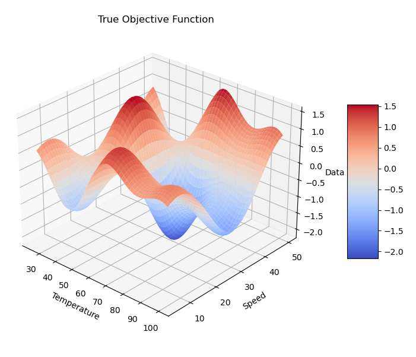

## Example 6: Autonomous Process Optimization

Example 6 generates a random objective function each time. Below is an example of the results after running 30 iterations of the mock experiment. After 30 iterations the minimum is found at a temperature of 67.3 and a speed of 30.4, near the true minimum.

### True objective function without noise

### Convergence plot

### Estimated objective function and evaluations

